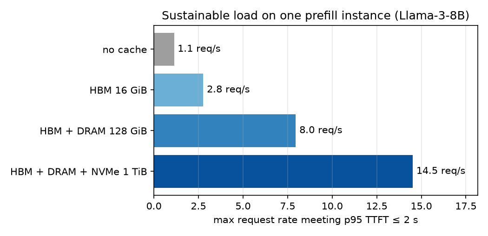
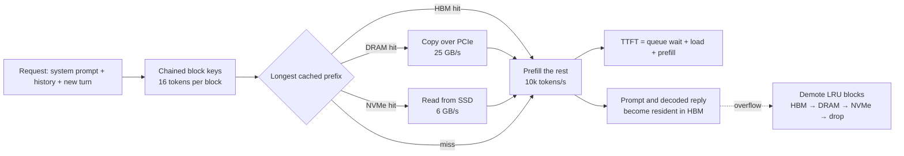
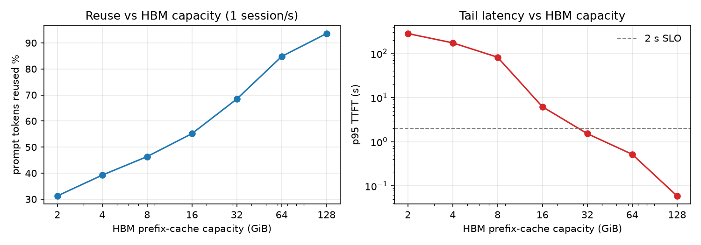

# Tiered KV Cache Lab

[](https://github.com/asher0913/tiered-kv-cache-lab/actions/workflows/ci.yml)


[](LICENSE)

A discrete-event simulator for **prefix caching in LLM serving**, with the KV cache spread across
GPU HBM, host DRAM and NVMe. It answers capacity-planning questions such as: *how much traffic can
one prefill GPU sustain under a 2-second p95 time-to-first-token target, and how much does a host
memory tier change that?*



Under the stated assumptions (Llama-3-8B, 10k tokens/s prefill, multi-turn chat), adding a
128 GiB DRAM tier behind a 16 GiB HBM prefix cache raises the load that meets the SLO from
**2.8 to 8.0 requests/s (2.9×)**. A 1 TiB NVMe tier takes it to **14.5 requests/s**, 13× the
no-cache baseline.

## What is modelled



- **Byte-accurate KV footprint.** `2 × layers × kv_heads × head_dim × dtype` per token, from the
  published grouped-query-attention configs: 128 KiB/token for Llama-3-8B, 320 KiB for
  Llama-3-70B, 56 KiB for Qwen2.5-7B. A 16 GiB HBM budget holds 131k tokens of Llama-3-8B KV.
- **Paged-attention block identity.** Each 16-token block's key hashes its parent's key, so a block
  is reusable only if its entire prefix is, exactly as in vLLM's automatic prefix caching.
- **Exclusive tiers.** Every block lives in one tier. Overflow demotes the LRU victim one tier
  down; a hit in DRAM or NVMe is copied back to HBM at that tier's bandwidth and latency.
- **Queueing.** A FIFO, disaggregated prefill instance: TTFT includes waiting behind earlier
  requests, so the simulator shows the saturation cliff, not just average cost.
- **Workload.** Poisson session arrivals; 24 system prompts (512–4,096 tokens, Zipf-popular);
  geometric turn counts (mean 4); 32–512-token user turns; 64–768-token replies; 45 s mean think
  time. Every turn resends the whole conversation, so the mean prompt is about 4.7k tokens.

All hardware figures are **assumptions**, recorded in [`results/assumptions.json`](results/assumptions.json)
and overridable from the CLI. The simulator's value is in the relative comparisons and the shape of
the curves, not in absolute latencies for a specific deployment.

## Results

### Tier configurations under load

| Sessions/s | Setup | Prompt tokens reused | Prefill utilization | p50 TTFT | p95 TTFT |
|---:|---|---:|---:|---:|---:|
| 0.5 | no cache | 0% | 0.83 | 2.17 s | 14.5 s |
| 0.5 | HBM 16 GiB | 63.7% | 0.30 | 0.17 s | 0.90 s |
| 0.5 | HBM + DRAM | 93.4% | 0.07 | 0.04 s | 0.08 s |
| 1.0 | no cache | 0% | 0.97 | 329 s | 787 s (saturated) |
| 1.0 | HBM 16 GiB | 55.2% | 0.74 | 1.44 s | 6.18 s |
| 1.0 | HBM + DRAM | 93.7% | 0.14 | 0.04 s | 0.08 s |
| 2.0 | HBM 16 GiB | 53.0% | 0.94 | 264 s | 739 s (saturated) |
| 2.0 | HBM + DRAM | 89.0% | 0.43 | 0.06 s | 0.70 s |
| 2.0 | HBM + DRAM + NVMe | 93.9% | 0.30 | 0.05 s | 0.13 s |

Twenty-minute runs; 0.5 sessions/s is about 1.8 requests/s. The lower tiers matter because of
think time: a conversation that pauses for a minute is pushed out of HBM by other traffic, and
without a DRAM tier its next turn recomputes thousands of tokens of history.

### Where the knee is



With HBM alone, the 2 s SLO at 1 session/s needs roughly 32 GiB of prefix cache. The same
target is met by 16 GiB of HBM plus host DRAM, which is far cheaper per byte.

### Eviction order: LRU vs leaf-first

Plain LRU touches a prompt's blocks front to back, so the head of an idle conversation is its
oldest block and is evicted first, stranding every block behind it. Leaf-first touches blocks back
to front (vLLM does the same when it frees a sequence), so chains are trimmed from the tail.

| HBM | Policy | Reuse | p95 TTFT | Stranded blocks at end of run |
|---:|---|---:|---:|---:|
| 4 GiB | LRU | 37.9% | 195 s | 163 of 2,048 (8.0%) |
| 4 GiB | leaf-first | **39.2%** | **174 s** | 0 |
| 16 GiB | LRU | 54.9% | 6.38 s | 195 of 8,192 (2.4%) |
| 16 GiB | leaf-first | **55.2%** | **6.18 s** | 0 |

The gain is real but modest (0.3–1.3 points of reuse, 3–11% lower p95) and largest when capacity
is tight; its main value is that no capacity is ever wasted on unreachable blocks.

### Sensitivity

| Question | Finding |
|---|---|
| PCIe bandwidth (2 sessions/s, HBM + DRAM) | 8 → 50 GB/s lowers p95 TTFT from 1.07 s to 0.66 s; total DRAM copy time falls from 235 s to 38 s. Reuse is unchanged at 89%. |
| Bigger KV per token (1 session/s, HBM only) | Llama-3-70B (320 KiB/token) reuses 44% and saturates (p95 108 s); Qwen2.5-7B (56 KiB) reuses 71% (p95 1.3 s). With the DRAM tier all three stay under 1 s. |

The model comparison holds prefill throughput fixed to isolate the memory effect; a 70B model
would also prefill several times slower.

## Usage

```bash
pip install -e '.[dev]'

kvtier run --rate 1.0 --hbm-gib 16 --dram-gib 128 --nvme-tib 1
kvtier run --rate 1.0 --dram-gib 0 --policy lru --model llama-3-70b
kvtier compare --rates 0.5 1.0 2.0
kvtier plan --slo 2.0
kvtier report --out results          # every experiment, about 2 minutes
python scripts/make_figures.py       # needs matplotlib
```

## Tests

`pytest -q` runs 18 tests in about 3 seconds. They pin the KV footprint of each model config,
check that keys commit to their whole prefix, that tiers are exclusive and within capacity, that
overflow demotes and hits promote, that leaf-first eviction strands nothing while LRU strands a
suffix, that more HBM and an extra DRAM tier never reduce reuse on a fixed trace, that TTFT
without contention equals prefill time, and that the capacity planner ranks setups correctly.

## Limitations

- Prefill is modelled as a single FIFO server with linear cost in uncached tokens. Real engines
  batch prefills, chunk long prompts and interleave decode, and attention cost grows with context
  length.
- KV transfers are not overlapped with compute. Layer-wise prefetching would hide part of the
  DRAM and NVMe cost, so lower-tier results are conservative.
- Segments are block-aligned, so partially filled blocks are never shared.
- HBM capacity is a fixed prefix-cache budget; it does not shrink when many long requests are in
  flight.
- The workload is synthetic. The structure (shared system prompts, full-history resends, think
  time) is typical of chat traffic, but the parameters are illustrative rather than fitted to a
  production trace.

## License

MIT
