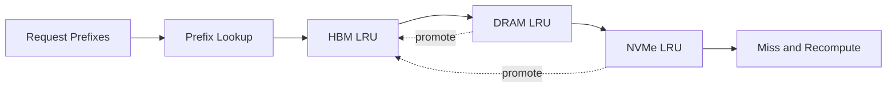

# Tiered KV Cache Lab

A deterministic GPU-to-CPU-to-NVMe cache simulator for long-context LLM serving, with promotion, demotion, prefix reuse, latency accounting, and capacity analysis.

This repository implements an original, laptop-scale reference system for a
production problem that repeatedly appears in strong AI/ML/software-engineering
portfolios. It focuses on architecture, failure handling, evaluation, and
reproducibility instead of claiming access to proprietary infrastructure.

## What is implemented

- Three latency/capacity tiers with byte-accurate LRU accounting
- Promotion on hit and recursive demotion under pressure
- Prefix-aware request simulation and cold-miss admission
- P50/P95 lookup latency, per-tier hit rate, eviction, and drop metrics
- Little's-Law capacity estimator for concurrency planning

## Architecture



## Quick start

```bash
python -m venv .venv
source .venv/bin/activate
python -m pip install -e .
python -m unittest discover -s tests -v
PYTHONPATH=src python src/tiered_kv_cache_lab/core.py
```

The demo prints a self-contained JSON report from seeded synthetic fixtures;
wall-clock latency values are machine-dependent. It is safe to run offline and
does not require credentials, paid APIs, GPUs, or employer data.

## Evaluation contract

The included workload uses a seeded hot/warm/cold prefix mix. Metrics distinguish HBM, DRAM, NVMe, and miss paths; capacity estimates are derived from measured service time and a configurable utilization target.

## Repository layout

- `src/tiered_kv_cache_lab/core.py` - executable reference implementation
- `tests/test_core.py` - deterministic regression and failure-path tests
- `benchmark-report.json` - checked-in output from the deterministic demo
- `.github/workflows/ci.yml` - clean-install CI on Python 3.12

## Scope and provenance

The problem definition was inspired by recurring engineering patterns observed
while reviewing a large resume corpus. All naming, source code, fixtures, and
documentation in this repository are original. Reported demo numbers are local
synthetic measurements, not production claims. The system is intentionally
compact so reviewers can inspect every design decision.

## License

MIT
